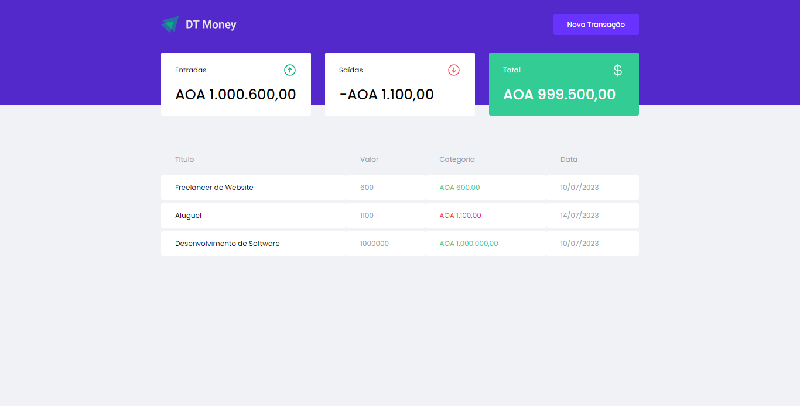

# IGNITE 
 ### DT-MONEY

 💻 Projecto

O DT-MONEY, é uma aplicação de controle financeiro, onde é possível cadastrar e controlar as transações feitas e ver o saldo💰

 🚀  Tecnologias usadas no projecto
   #### Esse projecto foi desenvolvido com as seguintes tecnologias:

* REACTJS
* TYPESCRIPT 
* STYLED-COMPONENTS
* Axios
* MIRAGEJS
  
  #### Git clone:
   * yarn - Para Instalar todas as dependências do projecto.
   * yarn start - Para inicializar.
   * Yarn build - Para gerar o build do projecto.

🔖 Layout do projecto 

